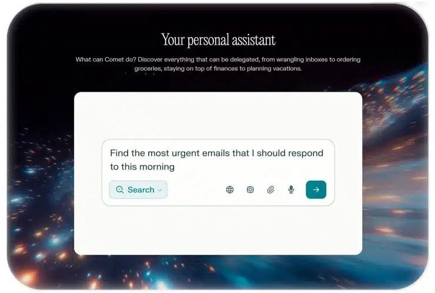
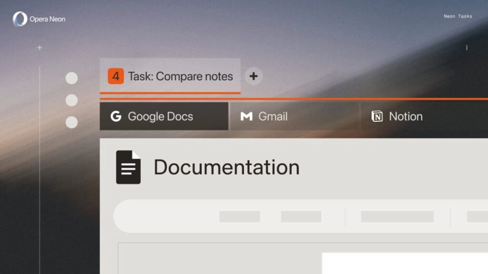

# Comet de Perplexity ya está disponible gratis: el navegador con IA que te ayuda a decidir

---

¿Cansado de abrir diez pestañas para comparar precios o planificar un viaje? [Comet de Perplexity](https://pplx.ai/ixkwood69619635) es un navegador con inteligencia artificial integrada que busca, compara y organiza por ti. Antes costaba hasta 200 dólares al mes, ahora es gratis para todos. Tú preguntas, el navegador te guía paso a paso, sin extensiones raras ni copiar y pegar entre ventanas.

---

## De exclusivo a gratuito: cómo cambió el acceso a Comet

Comet arrancó en julio como un lujo para quienes pagaban el plan más caro de Perplexity: 200 dólares mensuales. Después se abrió a usuarios Pro y a una lista de espera que, según la compañía, reunía millones de personas esperando turno.

Hoy cualquiera puede descargarlo sin pagar un centavo. Perplexity promete que seguirá así. Ojo: el navegador es gratis, pero hay un paquete de contenido extra (Comet Plus) que cuesta aparte. Son dos cosas distintas.

## Cómo funciona la IA dentro de Comet en tu día a día

La diferencia con otros navegadores es que aquí la IA no vive en una barra lateral que ignoras. Es tu copiloto permanente. Le preguntas algo, te responde con opciones claras, y puedes refinar sin salir de la página.

Tres escenarios donde brilla:

- **Compras online**: le dices "zapatillas para correr 10K con buen soporte" y te filtra por precio, valoraciones y tiendas con envío rápido.
- **Reservas de viajes**: "fin de semana en Lisboa en noviembre, presupuesto medio" y te arma vuelos, hoteles cerca del centro y actividades, todo con políticas de cancelación a la vista.
- **Gestión de tareas**: extrae fechas de correos, crea listas de pendientes y marca lo resuelto. Tú revisas y confirmas.

El control final siempre es tuyo. Puedes revisar fuentes, comparar detalles y cambiar de opinión antes de hacer clic en "comprar" o "reservar".

## Cinco pasos prácticos para sacarle jugo al asistente de IA

1. **Pregunta directo**: "necesito unas zapatillas para correr 10K con buen soporte". Nada de rodeos.
2. **Compara sin abrir mil pestañas**: pide alternativas con pros y contras, y que te muestre opciones en tiendas conocidas.
3. **Planifica un viaje completo**: "fin de semana en Lisboa en noviembre con presupuesto medio" y deja que te arme vuelos, hoteles y actividades.
4. **Afina los detalles**: añade "sin escalas y cancelación flexible" o "hotel con desayuno incluido". Guarda las URLs clave como recordatorio.
5. **Gestiona tareas cotidianas**: extrae fechas, crea un listado de pendientes y marca lo resuelto. Siempre revisa políticas de cambios y devoluciones antes de confirmar.

## Comet vs Chrome con Gemini: dos formas de entender la IA en el navegador

Google también metió Gemini en Chrome, pero el enfoque es distinto. En Chrome, la IA es un añadido que puedes usar o ignorar. En [Comet de Perplexity](https://pplx.ai/ixkwood69619635), la asistencia es la base de todo. No es una función extra, es el centro de la experiencia.

Si vienes de la app móvil de Perplexity, el cambio de ritmo se nota: todo fluye en la misma interfaz, sin saltos ni interrupciones.

## Comet Plus: noticias curadas por 5 dólares al mes (o gratis si ya pagas Pro o Max)

Junto al navegador, Perplexity lanzó Comet Plus, un paquete de suscripción a 5 dólares para acceder a noticias seleccionadas al estilo de Apple News Plus. Los socios iniciales incluyen CNN, Conde Nast, Fortune, Le Figaro, Le Monde, The Los Angeles Times y The Washington Post.

**Dato importante**: Comet Plus no es gratuito para todo el mundo. Está incluido para suscriptores de los planes Perplexity Pro y Max, y el resto puede acceder por 5 dólares al mes. Recuerda que el navegador Comet es gratis y lo puedes usar sin pagar este extra.

## Otros navegadores con IA: Arc con Dia y Opera Neon también compiten

Perplexity no está sola. The Browser Company impulsa la IA con "Dia" dentro de Arc, que también explora una navegación guiada por asistentes. Opera presentó su navegador con IA, Neon, como un giro a su línea clásica.

Tú eliges qué enfoque encaja mejor con tu forma de navegar. Con todo, [Comet de Perplexity](https://pplx.ai/ixkwood69619635) busca diferenciarse porque la asistencia no vive en una barra aparte, sino que te acompaña por cada página.

## Guía rápida: cómo empezar con Comet gratis hoy mismo

1. **Abre la web oficial**: busca "Comet Perplexity" y entra en la página del navegador para tu sistema.
2. **Descarga e instala**: elige la versión adecuada (ordenador o versión web si está disponible) y sigue el asistente.
3. **Inicia sesión o prueba sin cuenta**: crea una cuenta si quieres guardar historial y preferencias, o explora primero sin registro.
4. **Empieza con una tarea real**: plantea una compra, una reserva o una duda concreta y pide un plan paso a paso.
5. **Refina la búsqueda**: añade límites de precio, fechas, marcas y política de devoluciones para resultados más útiles.
6. **Guarda lo importante**: marca enlaces clave, copias listas y suma recordatorios para cerrar la tarea más tarde.
7. **Explora Comet Plus si te interesa**: si quieres acceso a noticias curadas, valora la suscripción o comprueba si ya está incluida en tu plan.

## Preguntas rápidas sobre Comet de Perplexity

**¿Es gratis para siempre?**  
La empresa afirma que Comet de Perplexity seguirá siendo gratuito para todos. Los paquetes de contenido como Comet Plus son de pago salvo en planes Pro o Max.

**¿Qué diferencia clave tiene?**  
La IA no es un añadido, es el centro de la navegación. Vas a poder pedir, comparar y decidir sin salir del flujo principal.

**¿En qué tareas ayuda más?**  
Destaca en compras online, reservas de viajes y gestión de tareas, donde reduce pasos y te ofrece contexto útil a cada clic.

---

Si buscas un navegador que te acelere el día a día, Comet de Perplexity ya está disponible gratis y listo para ayudarte con compras, viajes y organización personal. Prueba [Comet de Perplexity](https://pplx.ai/ixkwood69619635), compáralo con Chrome y decide con tranquilidad qué experiencia con IA encaja mejor contigo. La razón es simple: aquí la inteligencia artificial no es un extra, es tu compañera de navegación desde el primer clic.
